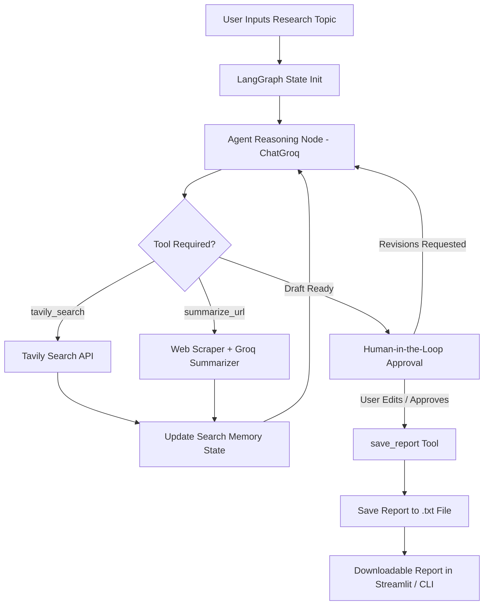

# 🤖 Autonomous AI Research Agent

An end-to-end autonomous research agent powered by **LangGraph**, **Groq LLM (llama-3.3-70b-versatile)**, **Tavily Search API**, and **Streamlit UI**. 

The agent runs a stateful ReAct (Reasoning + Acting) loop with search memory, scrapes and summarizes URLs, requires **Human-in-the-Loop (HITL)** approval before finalizing reports, and streams real-time execution steps in an interactive dashboard.

---

## 🌟 Key Features

1. **Groq LLM Powered**: Uses Groq's ultra-fast free API with `llama-3.3-70b-versatile` for tool-calling and reasoning.
2. **Three Specialized Tools**:
   - 🔍 `tavily_search`: Performs live web searches via Tavily API.
   - 🌐 `summarize_url`: Scrapes web page content and synthesizes focused LLM summaries.
   - 💾 `save_report`: Writes final research findings to local `.txt` files.
3. **LangGraph State Memory**:
   - Remembers previously searched queries to prevent duplicate search calls.
   - Tracks summarized URLs and execution step history.
4. **Human-in-the-Loop (HITL) Confirmation**:
   - Pauses before saving report to let the user review, edit, or approve report drafts.
5. **Streamlit UI Dashboard**:
   - Modern dark glassmorphism theme.
   - Live step-by-step reasoning & tool execution tracker.
   - Interactive report editor & download buttons.

---

## 📐 Agent Flow Diagram



---

## 🚀 Project Build Roadmap

- [x] **Step 1: Single Agent & Web Search Tool**: Integrated Tavily API search tool returning web results.
- [x] **Step 2: Confirm ReAct Loop**: Implemented LangGraph state graph with conditional edges.
- [x] **Step 3: Add Tool 2 (`summarize_url`)**: BeautifulSoup HTML text extraction + LLM summary.
- [x] **Step 4: Add Tool 3 (`save_report`)**: Local text file writer in `reports/` folder.
- [x] **Step 5: State Memory Tracking**: Agent remembers previous search queries to avoid redundancy.
- [x] **Step 6: Human-in-the-Loop (HITL)**: Preview, edit, and approve report drafts.
- [x] **Step 7: Streamlit Web UI**: Interactive visualization of agent thinking, steps, and report download.
- [x] **Step 8: Streamlit Cloud Deployment**: Production-ready configuration.

---

## 📁 Project Directory Structure

```
ai_research_agent/
├── app.py                   # Streamlit UI with Live Step Tracker & HITL Approval
├── cli.py                   # Terminal CLI runner for step-by-step verification
├── agent/
│   ├── __init__.py
│   ├── state.py             # LangGraph state schema (searched queries, step history)
│   ├── tools.py             # Tavily search, URL summarizer, Save report tools
│   └── graph.py             # LangGraph workflow graph definition
├── reports/                 # Output folder for saved research reports (.txt)
├── .env.example             # API keys template (GROQ_API_KEY, TAVILY_API_KEY)
├── requirements.txt         # Pinned project dependencies
└── README.md                # Project documentation & flow diagram
```

---

## 🛠️ Installation & Quickstart

### 1. Clone & Navigate to Project
```bash
cd c:/Users/acer/Documents/ai_research_agent
```

### 2. Install Dependencies
```bash
pip install -r requirements.txt
```

### 3. Configure API Keys
Copy `.env.example` to `.env` and set your free API keys:
- Get a free **Groq API Key**: [https://console.groq.com/keys](https://console.groq.com/keys)
- Get a free **Tavily API Key**: [https://tavily.com](https://tavily.com)

```ini
GROQ_API_KEY=your_groq_api_key_here
TAVILY_API_KEY=your_tavily_api_key_here
```

*(Note: You can also enter API keys directly in the Streamlit sidebar UI).*

---

## 💻 Running the Application

### Option A: Launch Streamlit Web UI (Recommended)
```bash
streamlit run app.py
```
Open your browser at `http://localhost:8501`.

### Option B: Terminal CLI Mode
```bash
# Run interactive agent loop in terminal:
python cli.py

# Test individual tools directly:
python cli.py --test-tools
```

---

## ☁️ Deploying on Streamlit Cloud

1. Push this repository to **GitHub**.
2. Visit [Streamlit Community Cloud](https://share.streamlit.io/).
3. Click **New app**, select your repository, branch (`main`), and set Main file path to `app.py`.
4. Under **Advanced settings**, add your secrets:
   ```toml
   GROQ_API_KEY = "your_groq_api_key"
   TAVILY_API_KEY = "your_tavily_api_key"
   ```
5. Click **Deploy!** 🎉

---

## 📝 License & Author
Built as an open-source Autonomous AI Agent template powered by LangGraph, Groq, and Streamlit.
