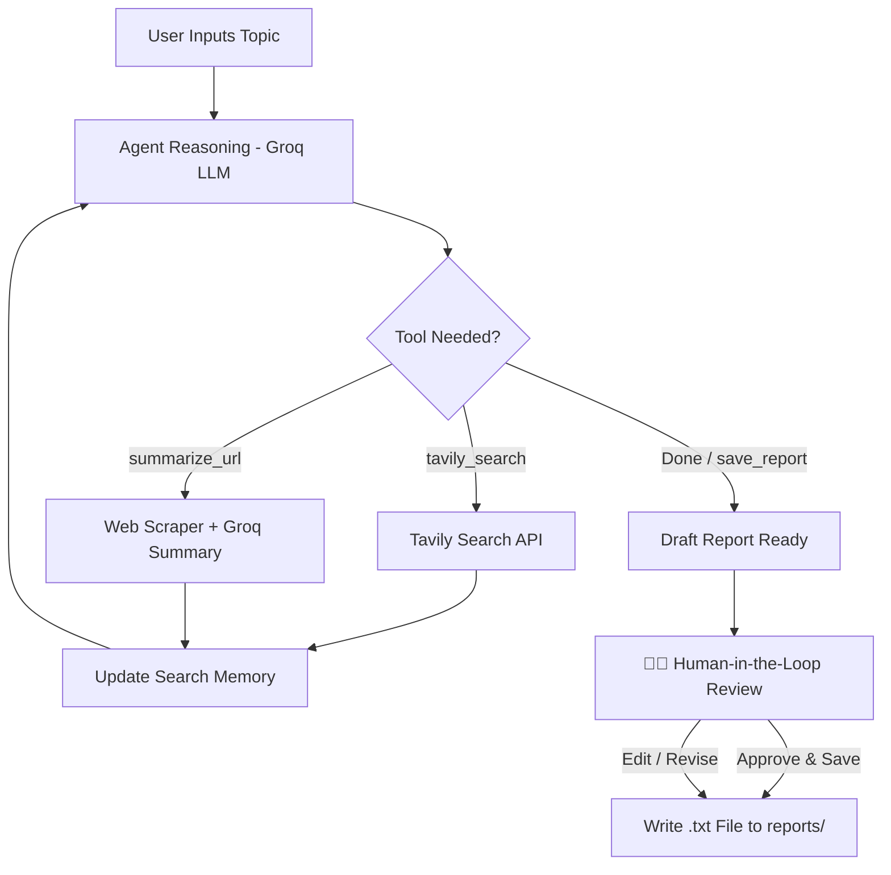

# 🤖 Autonomous AI Research Agent

An autonomous research agent built with **LangGraph**, **Groq (`openai/gpt-oss-120b`)**, **Tavily Search**, and **Streamlit**.

The agent runs a stateful **ReAct (Reasoning + Acting) loop** with search memory, summarizes web pages, requires **Human-in-the-Loop (HITL)** approval before saving reports, and visualizes live progress in Streamlit.

---

## 📐 Agent Flow Diagram



---

## 🌟 Key Features

1. **Groq Speed**: Powered by `openai/gpt-oss-120b` for ultra-fast, free agentic reasoning.
2. **3 Essential Tools**:
   - 🔍 `tavily_search`: Searches the web for live sources.
   - 🌐 `summarize_url`: Scrapes and summarizes web pages.
   - 💾 `save_report`: Writes synthesized reports to `reports/`.
3. **Search Memory**: Remembers past search queries so the agent never repeats itself.
4. **Human-in-the-Loop**: Preview and edit the draft report before approving and saving to disk.
5. **LangSmith Tracing**: Full observability of agent reasoning, tool calls, and execution steps.

---

## 📁 Project Structure

```
ai_research_agent/
├── app.py              # Streamlit Web UI (live steps + HITL confirmation)
├── cli.py              # Terminal CLI runner
├── agent/
│   ├── state.py        # LangGraph state schema (messages, memory)
│   ├── tools.py        # 3 tools: tavily_search, summarize_url, save_report
│   └── graph.py        # LangGraph ReAct workflow definition
├── reports/            # Output folder for saved research reports (.txt)
├── .env                # API keys
├── requirements.txt    # Minimal dependencies (only 7 packages)
└── README.md           # Documentation
```

---

## 🛠️ Quickstart

### 1. Install Dependencies
```bash
pip install -r requirements.txt
```

### 2. Configure API Keys
Edit `.env` (or set them directly in the Streamlit UI):
```ini
GROQ_API_KEY=gsk_your_groq_api_key_here
TAVILY_API_KEY=tvly-your_tavily_api_key_here
GROQ_MODEL=openai/gpt-oss-120b

# Optional: LangSmith Tracing
LANGCHAIN_TRACING_V2=true
LANGCHAIN_API_KEY=lsv2_pt_your_langsmith_key
LANGCHAIN_PROJECT=autonomous-research-agent
```
- Free Groq key: [console.groq.com/keys](https://console.groq.com/keys)
- Free Tavily key: [tavily.com](https://tavily.com)
- Free LangSmith key: [smith.langchain.com](https://smith.langchain.com)

---

## 💻 Running the Application

### Option A: Streamlit Web UI (Recommended)
```bash
streamlit run app.py
```
Open `http://localhost:8501`. Enter a topic, watch the agent think and execute tools live, edit the final report, and approve saving.

### Option B: Terminal CLI
```bash
# Test the 3 tools:
python cli.py --test-tools

# Run full interactive agent:
python cli.py
```

---

## ☁️ Deploy on Streamlit Cloud

1. Push this folder to a **GitHub repository**.
2. Go to [share.streamlit.io](https://share.streamlit.io) and select your repo.
3. In **Advanced Settings** → **Secrets**, add:
   ```toml
   GROQ_API_KEY = "gsk_your_key"
   TAVILY_API_KEY = "tvly-your_key"
   ```
4. Click **Deploy**! 🚀
